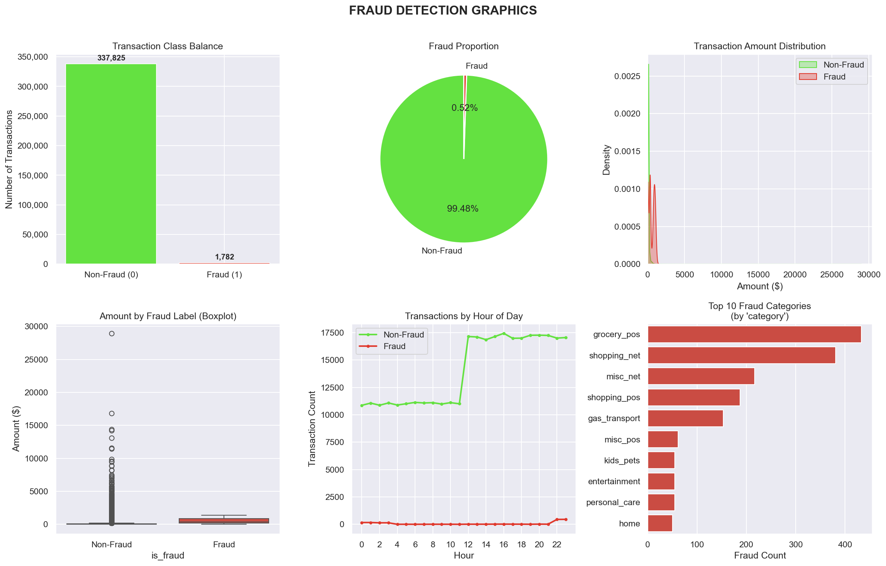
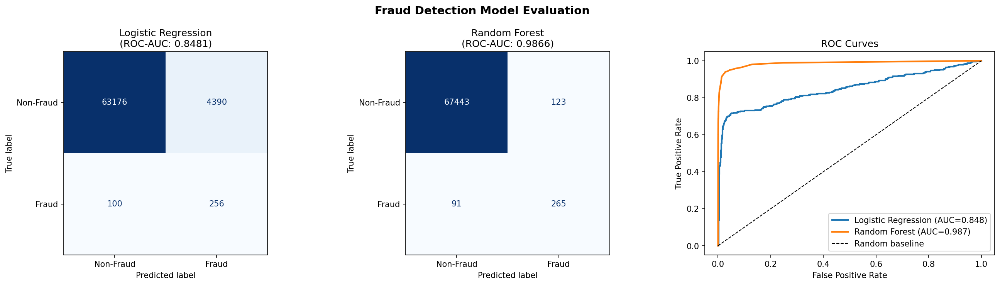
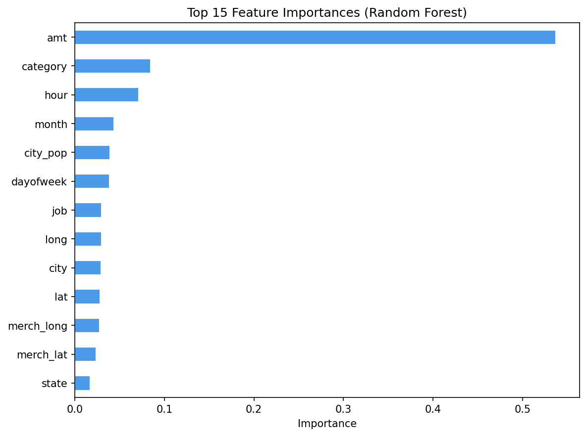

# 🔍 Credit Card Fraud Detection System

A machine learning pipeline that detects fraudulent credit card transactions using exploratory data analysis, visualization, and supervised classification models.

---

## 📌 Project Overview

Credit card fraud is a major financial problem. This project builds a system that learns from historical transaction data to automatically flag suspicious transactions — faster and more reliably than manual review.

The dataset (`credcard_fraud.csv`) is highly imbalanced: only **0.52%** of transactions are fraudulent. This project addresses that challenge directly using **SMOTE** (Synthetic Minority Oversampling Technique) before training.

---

## 📁 Project Structure
 
fraud_detection_project/
│
├── credcard_fraud.csv              # Raw transaction dataset
│
├── fraudData.py                    # Step 1: Understand the dataset
├── fraud_visualization.py          # Step 2: Visualize fraud patterns from dataset
├── fraud_model.py                  # Step 3: Train & evaluate Machine Learning models
│
├── fraud_analysis.png              # Output: EDA dashboard
├── fraud_model_results.png         # Output: Confusion matrices + ROC curves
└── fraud_feature_importance.png    # Output: Top predictive features


## ⚙️ Setup

### Requirements

- Python 3.9+
- Virtual environment (recommended)

### Install dependencies

```bash
python3 -m pip install pandas numpy matplotlib seaborn scikit-learn imbalanced-learn
```

---

## 🚀 How to Run

Run the three scripts in order from your project directory:

```bash
# Step 1 — Understand the data
python3 fraudData.py

# Step 2 — Visualize fraud patterns
python3 fraud_visualization.py

# Step 3 — Train the model
python3 fraud_model.py
```

---

## 📊 Pipeline Breakdown

### Step 1 — `fraudData.py`
Loads the dataset and prints a summary to the terminal:
- Shape (rows × columns)
- Missing value check
- Fraud vs non-fraud counts
- Percentage of fraudulent transactions
- Amount statistics by class

### Step 2 — `fraud_visualization.py`
Generates a 6-panel EDA dashboard saved as `fraud_analysis.png`:

| Panel | Description |
|-------|-------------|
| Class Balance (bar) | Count of fraud vs non-fraud |
| Fraud Proportion (pie) | 99.48% non-fraud / 0.52% fraud |
| Amount Distribution | KDE showing fraud skews higher |
| Amount Boxplot | Median fraud amount much higher than non-fraud |
| Transactions by Hour | Fraud peaks late at night (12am–4am) |
| Top Fraud Categories | grocery_pos, shopping_net, misc_net lead |

### Step 3 — `fraud_model.py`
Full ML pipeline:
1. Drops non-informative columns (name, address, card number, etc.)
2. Engineers datetime features (hour, day of week, month)
3. Encodes categorical variables
4. Splits data 80/20 with stratification
5. Applies **SMOTE** to fix class imbalance
6. Trains two models: **Logistic Regression** and **Random Forest**
7. Evaluates using ROC-AUC (receiver operating characteristic- area under curve), classification report, and confusion matrix
8. Plots feature importances for Random Forest

---

## 📈 Results

| Model | ROC-AUC |
|-------|---------|
| Logistic Regression | 0.8481 |
| **Random Forest** | **0.9866** ✅ |

**Random Forest** is the best-performing model with a ROC-AUC of **0.9866**, correctly identifying the vast majority of fraudulent transactions while keeping false positives very low (only 123 false alarms out of 67,566 legitimate transactions).

### Top Predictive Features (Random Forest)
1. `amt` — Transaction amount (by far the most important)
2. `category` — Merchant category
3. `hour` — Time of day
4. `month`, `city_pop`, `dayofweek`

---

## 🧠 Key Concepts Used

- **SMOTE** — Oversamples the minority (fraud) class to fix imbalance
- **Label Encoding** — Converts categorical columns to numeric
- **StandardScaler** — Normalizes features for Logistic Regression
- **ROC-AUC** — Primary evaluation metric for imbalanced classification
- **Feature Importance** — Identifies which variables drive predictions

---

## 📷 Sample Output

### EDA Dashboard


### Model Evaluation


### Feature Importance

